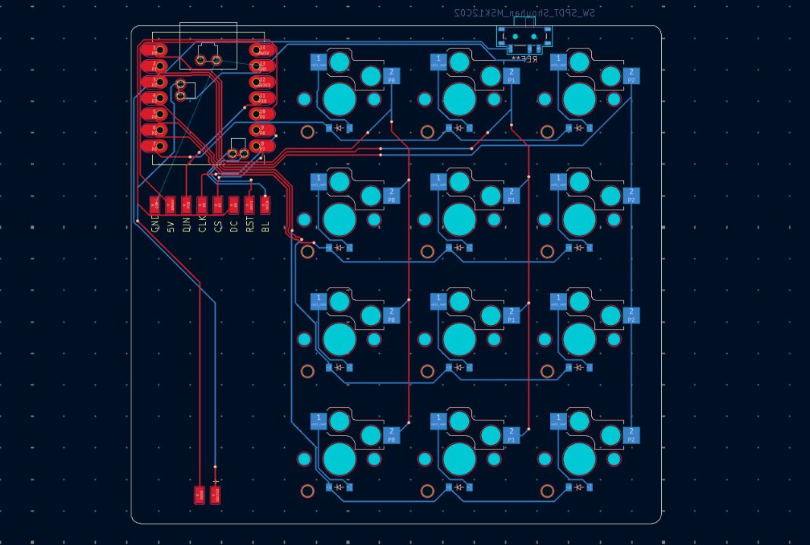
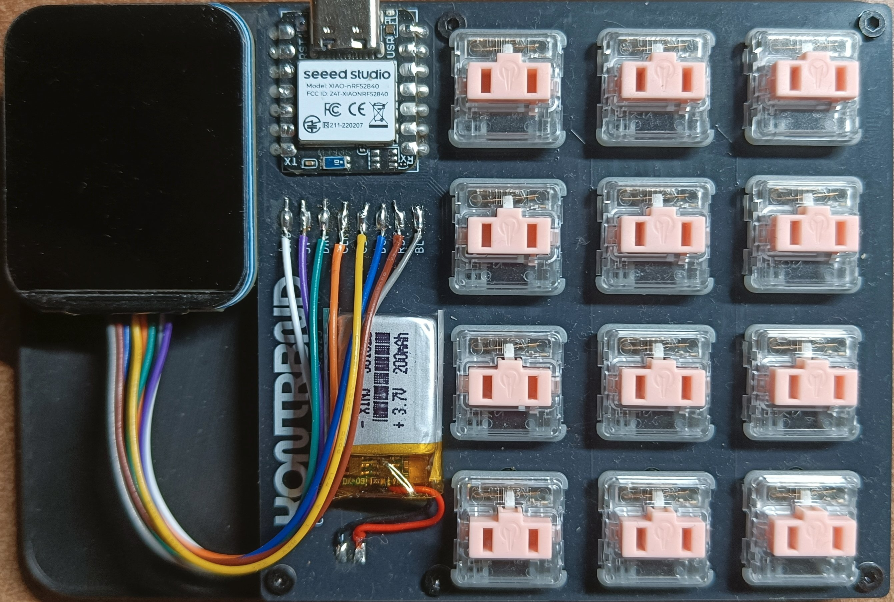

## Overview

CTRL is a small macropad project created as a practical and fun side project.  
The goal is not to build a product or solve a specific problem, but to explore the design and implementation of a compact, programmable input device and to document the process along the way.

The documentation reflects this approach: it focuses on what exists, what is planned, and how the project evolves over time.

## Project Direction

The project is developed in clearly separated stages.

The first step is a working prototype built on custom hardware while relying on existing firmware solutions. This allows validation of the core hardware design and basic functionality.

After the prototype stage, the plan is to develop a more stable second version. This iteration will include hardware improvements, a custom firmware tailored specifically to CTRL, and a desktop application that allows easier configuration of layers and actions.

## Current State

At the moment, the project is in the prototype stage.

The current prototype consists of the key matrix and an OLED display. A rotary encoder is planned for the second version.

As of now, only the key matrix is fully functional and working as intended. The OLED display is already integrated, but support for it is still in progress and not yet complete.

This stage is focused on verifying the basic hardware design, detecting possible problems, and establishing a foundation for further development rather than feature completeness.

## Prototype

Below are images from the current development stage:

- **Custom PCB**  
  
  The first revision of the custom-designed PCB used for the prototype.

- **Prototype Test Bench**  
  
  The assembled prototype during early testing, used to validate the key matrix and basic behavior.
